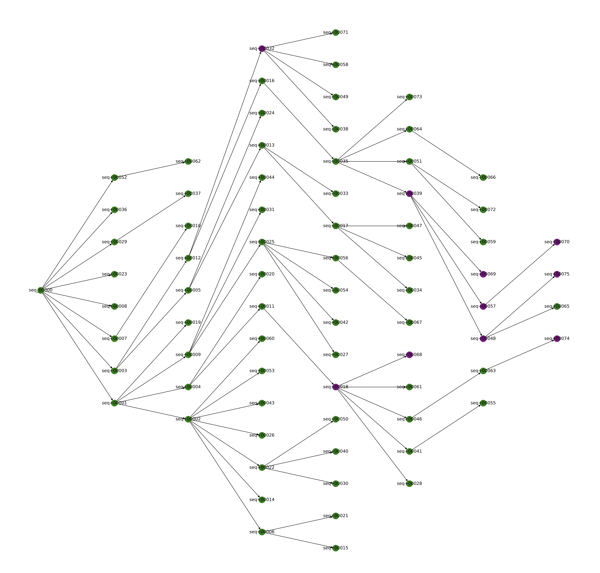

# `benchmark`

`benchmark` is a helper package for [`pyani-plus`](https://github.com/pyani-plus/pyani-plus) that generates mock bacterial genome sequences with known pairwise sequence identities. It is intended for benchmarking the accuracy and precision of genome distance calculation/estimation tools, including `pyani-plus`.

## Installation

1. Clone the repository from [https://github.com/pyani-plus/benchmark](https://github.com/pyani-plus/benchmark).
2. Change to the `benchmark` directory.
3. Install using `pip install -U -e .

The benchmark tool will be available as `pyani-benchmark`

```bash
git clone git@github.com:pyani-plus/benchmark.git
cd benchmark
pip install -U -e .
pyani-benchmark --help
```

## Usage

Invoke the tool with `pyani-benchmark`. To see inline help, use `pyani-benchmark --help`.

```bash
% pyani-benchmark --help

 Usage: pyani-benchmark [OPTIONS]

 Entry point for the pyani-benchmark CLI.


╭─ Options ─────────────────────────────────────────────────────────────────────────────────────────────────────╮
│ --generations               INTEGER         Number of generations to evolve genome pool. [default: 10]        │
│ --seed                      INTEGER         Seed value for PRNG (0 sets no PRNG seed value). [default: 0]     │
│ --seqlen                    INTEGER         Seed genome length. [default: 1000000]                            │
│ --seqprefix                 TEXT            Prefix string for sequences. [default: seq]                       │
│ --alphabet                  [dna|rna|prot]  Seed sequence alphabet [default: dna]                             │
│ --poolsize                  INTEGER         Maximum size of evolving genome pool. [default: 100]              │
│ --subrate                   FLOAT           Per-symbol substitution probability. [default: 0.01]              │
│ --outdir                    PATH            Path to output directory. [default: outdir]                       │
│ --version                                   Show the application version and exit.                            │
│ --install-completion                        Install completion for the current shell.                         │
│ --show-completion                           Show completion for the current shell, to copy it or customize    │
│                                             the installation.                                                 │
│ --help                                      Show this message and exit.                                       │
╰───────────────────────────────────────────────────────────────────────────────────────────────────────────────╯
```

### Example run

The command below will generate a set of ten synthetic genomes of size 1Mbp, applying an in-place substitution rate of 0.01 changes per base per generation, over 10 generations. placing output in the subdirectory `outdir`.

```bash
pyani-benchmark --poolsize 10 --seqlen 1000000 --subrate 0.01 --generations 10 --outdir outdir
```

As it runs, `pyani-benchmark` will report on progress, stating initial settings, and reporting the size of the genome pool at each generation. A progress bar indicates how far the generation of synthetic sequences has progressed.

```bash
% pyani-benchmark --poolsize 10 --seqlen 1000000 --subrate 0.01 --generations 10 --outdir outdir
Running pyani-benchmark script...
Generating random sequence record...
        ...random sequence seq_00000 has length 1000000.
Creating sequence pool, seeding with seq_00000....
        ...sequence pool has length 1.
        ID: seq_00000
Name: seq_00000
Description: Randomly-generated sequence
Number of features: 0
Seq('ATCCAAGCAGTCTGCGATGTCAGGAGGTATAAGGGAGGTTGAATGGGTGGTTAA...CCG')
Evolving pool for 10 generations.
Generation: 0, pool size: 2
Generation: 1, pool size: 4
Generation: 2, pool size: 8
Generation: 3, pool size: 10
Evolving... ━━━━━━━━━━━━━━━━╺━━━━━━━━━━━━━━━━━━━━━━━  40% -:--:--
```

This will generate the director `outdir` with the following contents:

```bash
% ls outdir
initial_pool/             initial_pool_heatmap.pdf
```

The file `initial_pool_heatmap.pdf` contains a PDF file summarising the percentage identities of equivalent bases for all pairwise comparisons of the generated sequences. This is the objective output of the sequence generation process, not a measurement or estimate. In the heatmap, red cells indicate high percentage identity (>95%), blue cells represent lower percentage identity.

<div style="text-align: center;">
    95%), blue cells represent lower percentage identity.(<95%)" width="400">
</div>

The `initial_pool` subdirectory contains files describing the output synthetic genomes, and their pairwise identity differences.

```bash
% ls -1 outdir/initial_pool
initial_pool_distances_long.csv
initial_pool_distances.csv
initial_pool_distances.mat
initial_pool_graph.gml
initial_pool_graph.pdf
initial_pool_sequences/
initial_pool_sequences.fasta
```

Individual FASTA files describing each sequence are found in the subdirectory `initial_pool_sequences`. A multi-FASTA file containing all the synthetic genome sequences is provided in the `initial_pool_sequences.fasta` file.

The relationships between all generated synthetic sequences are described visually in the `initial_pool_graph.pdf` file. The left-most node in the graph is the initial seed sequence, and the parent-child relationships proceed from left to right. Nodes coloured in purple are present in the final pool. Nodes in green are lost as the process of generating new sequences proceeds.

<div style="text-align: center;">
    
</div>

The `initial_pool_graph.gml` file contains a GraphML representation of these parent-child relationships.

The `initial_pool_distances*` files contain quantitative sequence identity values for each pair of genomes in the initial pool. The `initial_pool_distances.mat` file is a matrix of these distances; `initial_pool_distances.csv` is a comma-separated variable tabular file comprising the same information, but with row and column headers. The `initial_pool_graph_long.csv` file is a comma-separated variable file with the same data, provided in long-format for convenience when using `pyani-plus` or other tools to calculate pairwise similarity scores for the same sequences in the format:

```text
genome1,genome2,identity
seq+00018,seq+00018,1.0
seq+00018,seq+00069,0.906347
seq+00018,seq+00048,0.906337
[...]
```
